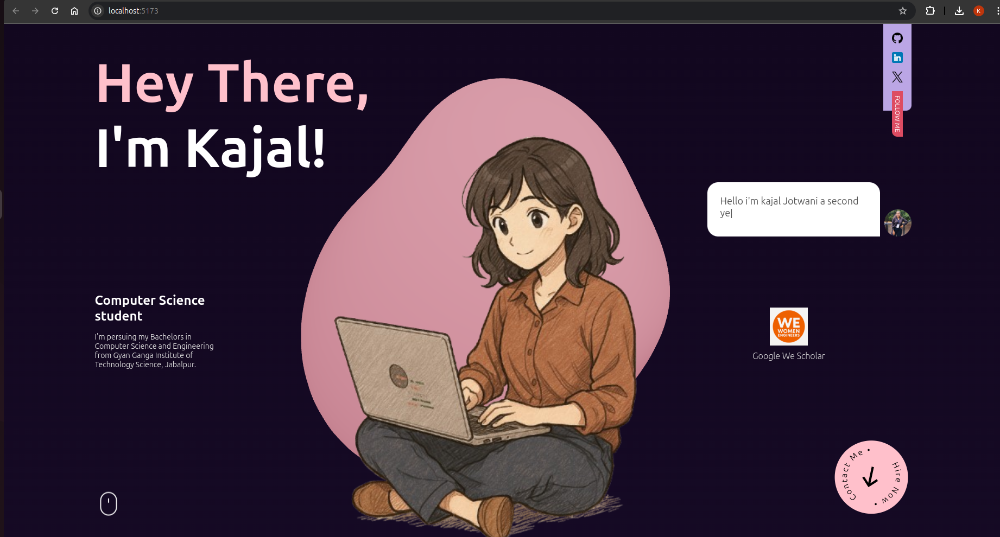

# 🌐 Personal Portfolio

Welcome to my 3D portfolio website! This project is built using **Three.js**, **React**, and **React Three Fiber** as a fun and creative way to explore and learn 3D web development.

## 🚀 Tech Stack

- **React** – for building the UI
- **Three.js** – for creating 3D elements
- **React Three Fiber** – a React renderer for Three.js
- **Drei** – helpful abstractions for React Three Fiber

## 🎯 Purpose

This project was created to learn and experiment with 3D rendering on the web using Three.js and React. It showcases my projects, skills, and contact info in an interactive 3D experience.

## 📸 Features

- Interactive 3D scene
- Smooth animations and transitions
- Responsive design
- Clean and minimal UI

## 🛠️ Installation

```bash
git clone https://github.com/your-username/3d-portfolio.git

cd 3d-portfolio

npm install

npm run dev
